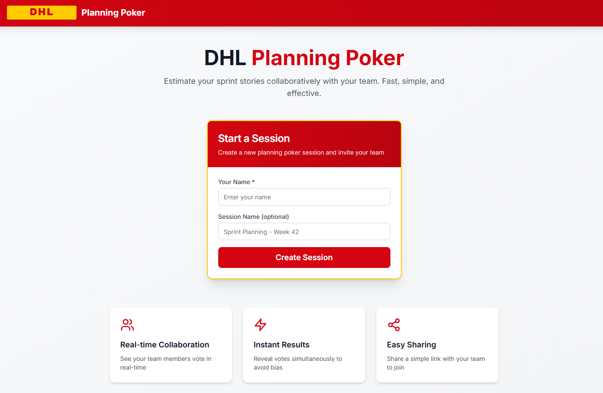
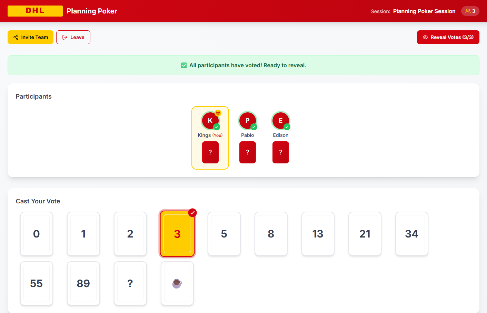
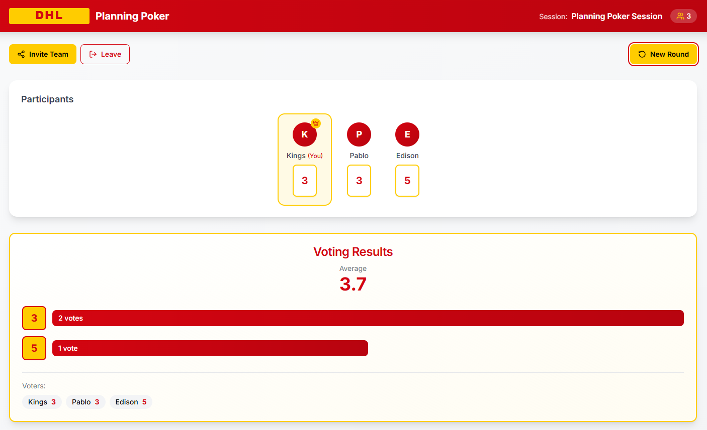

# DHL Planning Poker

A real-time Planning Poker application with DHL branding, built with React, shadcn/ui, and Node.js.








## Features

- **Real-time Collaboration**: See your team members vote in real-time using WebSockets
- **Easy Sharing**: Share a simple link with your team to join the session
- **Instant Results**: Reveal votes simultaneously to avoid anchoring bias
- **DHL Branding**: Professional look and feel matching DHL design guidelines
- **Responsive Design**: Works on desktop and mobile devices

## Tech Stack

- **Frontend**: React 18, TypeScript, Vite, Tailwind CSS, shadcn/ui
- **Backend**: Node.js, Express, Socket.IO
- **Styling**: DHL brand colors (Yellow #FFCC00, Red #D40511)

## Getting Started

### Prerequisites

- Node.js 18+ installed
- npm or yarn package manager

### Installation

1. **Clone the repository**
   ```bash
   cd DHLPlanningPoker
   ```

2. **Install server dependencies**
   ```bash
   cd server
   npm install
   ```

3. **Install client dependencies**
   ```bash
   cd ../client
   npm install
   ```

### Running the Application

1. **Start the server** (from the server directory)
   ```bash
   cd server
   npm run dev
   ```
   The server will start on http://localhost:3001

2. **Start the client** (from the client directory, in a new terminal)
   ```bash
   cd client
   npm run dev
   ```
   The client will start on http://localhost:5173

3. **Open your browser** and navigate to http://localhost:5173

## Usage

### Creating a Session

1. Enter your name
2. Optionally enter a session name
3. Click "Create Session"
4. Share the invite link with your team

### Joining a Session

1. Click the shared link
2. Enter your name
3. Click "Join Session"

### Voting

1. Click on a card to cast your vote
2. Wait for all participants to vote
3. Anyone can reveal the votes
4. Click "New Round" to start a new estimation

## Voting Cards

The app includes standard Fibonacci-like story point cards:
- 0, 1, 2, 3, 5, 8, 13, 21, 34, 55, 89
- ? (Don't know)
- ☕ (Need a break)

## Project Structure

```
DHLPlanningPoker/
├── server/
│   ├── index.js          # Express + Socket.IO server
│   └── package.json
├── client/
│   ├── src/
│   │   ├── components/   # React components
│   │   │   ├── ui/       # shadcn/ui components
│   │   │   ├── Header.tsx
│   │   │   ├── VoteCard.tsx
│   │   │   ├── ParticipantCard.tsx
│   │   │   └── VotingResults.tsx
│   │   ├── pages/        # Page components
│   │   │   ├── HomePage.tsx
│   │   │   ├── JoinPage.tsx
│   │   │   └── RoomPage.tsx
│   │   ├── context/      # React contexts
│   │   ├── hooks/        # Custom hooks
│   │   ├── lib/          # Utilities
│   │   ├── App.tsx
│   │   └── main.tsx
│   ├── index.html
│   └── package.json
└── README.md
```

## API Endpoints

### REST API

- `POST /api/rooms` - Create a new room
- `GET /api/rooms/:roomId` - Check if room exists

### WebSocket Events

**Client to Server:**
- `join-room` - Join a planning poker room
- `submit-vote` - Submit a vote
- `reveal-votes` - Reveal all votes
- `reset-votes` - Start a new voting round

**Server to Client:**
- `room-state` - Current room state
- `participant-joined` - New participant joined
- `participant-left` - Participant left
- `vote-updated` - Vote submitted
- `votes-revealed` - Votes revealed
- `votes-reset` - Votes reset for new round

## License

MIT License - Built for DHL Agile Teams
